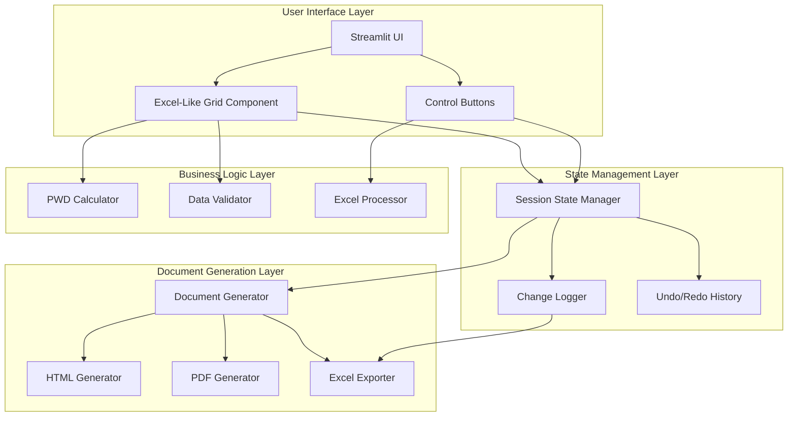
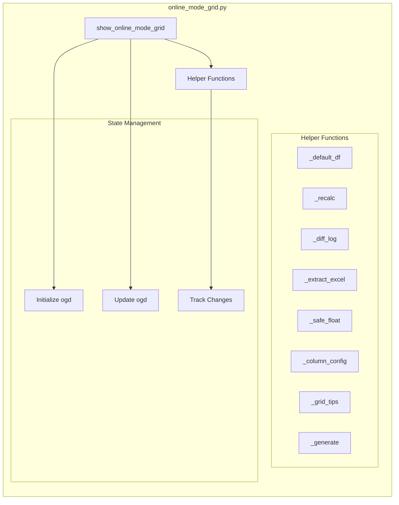
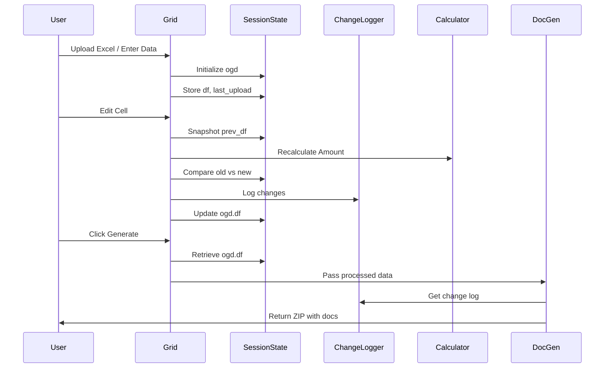

# Design Document: Streamlit Excel Grid Enhancement

## Overview

This design document specifies the architecture and implementation approach for enhancing the existing Streamlit-based Bill Generator application with Excel-like browser grid functionality. The enhancement preserves all existing PWD-specific business logic (LD calculations, GST rounding, hierarchical items, deductions) while improving the online data-entry user experience.

### Current State

The application currently uses `st.data_editor` in `core/ui/online_mode_grid.py` but suffers from critical bugs:

1. **Scope Error**: `edited_df` referenced in `generate_documents()` but defined in parent scope
2. **Upload Flag Bug**: `excel_uploaded` flag never resets, causing re-upload failures
3. **Change Tracking Bug**: Change tracking fires on every render instead of actual changes
4. **Missing Validation**: No validation for zero-quantity items
5. **Visual Distinction**: No visual distinction for part-rate items

### Design Goals

1. **Fix Critical Bugs**: Address all identified scope, state management, and tracking issues
2. **Preserve Business Logic**: Maintain all PWD calculations, GST rounding, and hierarchical processing
3. **Excel-Like UX**: Provide familiar Excel interactions (keyboard navigation, inline editing, copy/paste)
4. **Performance**: Handle datasets up to 10,000 rows with smooth rendering
5. **Accessibility**: Support screen readers and keyboard-only navigation
6. **Backward Compatibility**: Maintain existing interfaces and workflows

### Implementation Approach

**Phase 1 (Current Scope)**: Enhanced `st.data_editor` with bug fixes and proper state management
**Phase 2 (Future)**: Evaluate `streamlit-aggrid` for advanced features (freeze panes, undo/redo, row grouping)

This design focuses on Phase 1, which provides immediate value without introducing new dependencies.

## Architecture

### High-Level Architecture



### Component Architecture



### Data Flow



## Components and Interfaces

### 1. Session State Management

The session state dictionary `ogd` (online grid data) maintains all application state:

```python
st.session_state.ogd = {
    'project_name': str,        # Project name
    'contractor': str,          # Contractor name
    'bill_date': date | None,   # Bill date
    'tender_premium': float,    # Tender premium percentage
    'df': pd.DataFrame,         # Main DataFrame with work items
    'last_upload': str | None,  # Filename of last uploaded Excel
    'change_log': list[dict],   # List of change dictionaries
    'prev_df': pd.DataFrame | None  # Previous DataFrame for diff tracking
}
```

**Key Design Decisions**:
- Use filename tracking (`last_upload`) instead of boolean flag to detect new uploads
- Store `prev_df` for efficient change detection
- Maintain `change_log` as list of dictionaries for flexibility

### 2. Helper Functions

#### `_default_df(n: int, offset: int = 0) -> pd.DataFrame`

Creates a DataFrame with `n` blank rows starting from index `offset`.

**Interface**:
```python
def _default_df(n: int, offset: int = 0) -> pd.DataFrame:
    """
    Create default items DataFrame with n blank rows.
    
    Args:
        n: Number of rows to create
        offset: Starting index for item numbers
        
    Returns:
        DataFrame with columns: Status, Item No, Description, Unit, Quantity, Rate, Amount
    """
```

**Columns**:
- `Status`: str - Validation status emoji (⚪, 🟢, 🟠, 🔴)
- `Item No`: str - Item number (formatted as "001", "002", etc.)
- `Description`: str - Item description
- `Unit`: str - Unit of measurement (NOS, CUM, SQM, etc.)
- `Quantity`: float - Quantity (default 0.0)
- `Rate`: float - Rate in ₹ (default 0.0)
- `Amount`: float - Calculated amount (Quantity × Rate)

#### `_recalc(df: pd.DataFrame) -> pd.DataFrame`

Recalculates the Amount column based on Quantity and Rate.

**Interface**:
```python
def _recalc(df: pd.DataFrame) -> pd.DataFrame:
    """
    Recalculate Amount column for all rows.
    
    Args:
        df: DataFrame with Quantity and Rate columns
        
    Returns:
        DataFrame with updated Amount column
    """
```

**Logic**:
```python
df['Amount'] = df['Quantity'] * df['Rate']
return df
```

#### `_diff_log(old: pd.DataFrame, new: pd.DataFrame) -> list[dict]`

Generates change log entries by comparing two DataFrames.

**Interface**:
```python
def _diff_log(old: pd.DataFrame, new: pd.DataFrame) -> list[dict]:
    """
    Generate change log entries by comparing DataFrames.
    
    Args:
        old: Previous DataFrame state
        new: Current DataFrame state
        
    Returns:
        List of change dictionaries with keys:
            - timestamp: ISO format timestamp
            - item_no: Item number
            - field: Field name that changed
            - old_value: Previous value
            - new_value: Current value
            - reason: Reason for change (auto-generated)
    """
```

**Change Detection Logic**:
1. Compare DataFrame shapes (row count changes)
2. For matching rows, compare each editable field:
   - Description
   - Unit
   - Quantity (with special handling for zero → non-zero)
   - Rate (with part-rate detection)
3. Generate appropriate reason based on change type

#### `_extract_excel(file: UploadedFile) -> dict | None`

Extracts project details and work items from uploaded Excel file.

**Interface**:
```python
def _extract_excel(file: UploadedFile) -> dict | None:
    """
    Extract data from uploaded Excel file.
    
    Args:
        file: Streamlit UploadedFile object
        
    Returns:
        Dictionary with keys:
            - project_name: str
            - contractor: str
            - df: pd.DataFrame with work items
        Returns None on error
    """
```

**Integration**: Uses existing `ExcelProcessor` from `core.processors.excel_processor`

#### `_safe_float(val: Any, default: float = 0.0) -> float`

Safely converts values to float with fallback.

**Interface**:
```python
def _safe_float(val: Any, default: float = 0.0) -> float:
    """
    Safely convert value to float.
    
    Args:
        val: Value to convert
        default: Default value if conversion fails
        
    Returns:
        Float value or default
    """
```

#### `_column_config() -> dict`

Returns column configuration for `st.data_editor`.

**Interface**:
```python
def _column_config() -> dict:
    """
    Generate column configuration for st.data_editor.
    
    Returns:
        Dictionary mapping column names to st.column_config objects
    """
```

**Configuration**:
- Status: TextColumn (disabled, small width)
- Item No: TextColumn (required, small width)
- Description: TextColumn (required, large width)
- Unit: SelectboxColumn (required, predefined options)
- Quantity: NumberColumn (editable, min=0, step=0.01)
- Rate: NumberColumn (editable, min=0, step=0.01)
- Amount: NumberColumn (calculated, disabled)

#### `_grid_tips() -> None`

Displays usage tips for the grid interface.

**Interface**:
```python
def _grid_tips() -> None:
    """Display Excel-like grid usage tips."""
```

#### `_generate(config: dict) -> None`

Handles document generation and ZIP creation.

**Interface**:
```python
def _generate(config: dict) -> None:
    """
    Generate documents and create ZIP download.
    
    Args:
        config: Configuration dictionary with:
            - project_name: str
            - contractor: str
            - bill_date: date | None
            - tender_premium: float
            - df: pd.DataFrame
            - generate_html: bool
            - generate_pdf: bool
            - generate_docx: bool
    """
```

### 3. Change Tracking Logic

**Snapshot Strategy**:
1. Before showing `st.data_editor`, snapshot current DataFrame to `ogd['prev_df']`
2. After user edits, compare `edited_df` with `ogd['prev_df']`
3. Only track changes if DataFrames differ
4. Only update session state if changes detected

**Change Detection Algorithm**:
```python
def detect_changes(old_df, new_df):
    changes = []
    
    # Check shape changes
    if len(old_df) != len(new_df):
        # Rows added or deleted
        return True, changes
    
    # Check cell changes
    for idx in range(len(new_df)):
        item_no = new_df.loc[idx, 'Item No']
        
        # Check each editable field
        for field in ['Description', 'Unit', 'Quantity', 'Rate']:
            old_val = old_df.loc[idx, field]
            new_val = new_df.loc[idx, field]
            
            if old_val != new_val:
                reason = determine_reason(field, old_val, new_val)
                changes.append({
                    'timestamp': datetime.now().isoformat(),
                    'item_no': item_no,
                    'field': field,
                    'old_value': format_value(old_val),
                    'new_value': format_value(new_val),
                    'reason': reason
                })
    
    return len(changes) > 0, changes
```

**Reason Determination**:
- Quantity: 0 → non-zero = "Zero-Qty Activation"
- Quantity: non-zero → different = "Quantity Adjustment"
- Rate: decrease = "Rate Reduction" (potential part-rate)
- Rate: increase = "Rate Increase"
- Description: any change = "Description Update"
- Unit: any change = "Unit Change"

### 4. Validation Logic

**Validation Rules**:
1. **Empty Row** (⚪): All fields empty or zero → Ignored
2. **Valid Row** (🟢): Description + Quantity > 0 + Rate > 0
3. **Partial Row** (🟠): Description but missing Quantity or Rate
4. **Invalid Row** (🔴): Quantity or Rate without Description

**Implementation**:
```python
def update_validation_status(df):
    for idx, row in df.iterrows():
        qty = row['Quantity']
        rate = row['Rate']
        desc = row['Description'].strip()
        
        is_active = qty > 0 or rate > 0 or desc != ''
        
        if not is_active:
            status = '⚪'  # Empty
        elif desc and qty > 0 and rate > 0:
            status = '🟢'  # Valid
        elif desc == '' and (qty > 0 or rate > 0):
            status = '🔴 No Desc'  # Error
        elif desc != '' and (qty == 0 or rate == 0):
            status = '🟠 Miss Q/R'  # Partial
        else:
            status = '🔴 Inv'  # Invalid
        
        df.loc[idx, 'Status'] = status
    
    return df
```

### 5. Document Generation Integration

**Process**:
1. Validate all active items (must be 🟢)
2. Convert DataFrame to processed data structure
3. Call existing `DocumentGenerator` with processed data
4. Generate HTML, PDF, DOCX based on user selection
5. Create ZIP with organized folders
6. Include change log Excel sheet in ZIP

**Data Structure Conversion**:
```python
processed_data = {
    "title_data": {
        "Name of Work": project_name,
        "Contractor": contractor,
        "Bill Date": bill_date_str,
        "Tender Premium %": tender_premium
    },
    "work_order_data": [
        {
            "Item No.": row['Item No'],
            "Description": row['Description'],
            "Unit": row['Unit'],
            "Quantity": row['Quantity'],
            "Rate": row['Rate'],
            "Amount": row['Amount']
        }
        for _, row in df.iterrows()
    ],
    "totals": {
        "grand_total": df['Amount'].sum(),
        "premium": {
            "percent": tender_premium / 100,
            "amount": df['Amount'].sum() * (tender_premium / 100)
        },
        "payable": df['Amount'].sum() * (1 + tender_premium / 100),
        "net_payable": df['Amount'].sum() * (1 + tender_premium / 100)
    }
}
```

## Data Models

### DataFrame Schema

**Work Items DataFrame**:
```python
{
    'Status': str,          # Validation status: ⚪, 🟢, 🟠, 🔴
    'Item No': str,         # Item number (e.g., "001", "002")
    'Description': str,     # Item description
    'Unit': str,            # Unit of measurement
    'Quantity': float,      # Quantity (>= 0)
    'Rate': float,          # Rate in ₹ (>= 0)
    'Amount': float         # Calculated: Quantity × Rate
}
```

**Constraints**:
- `Quantity >= 0`
- `Rate >= 0`
- `Amount = Quantity × Rate` (always calculated, never user-editable)
- `Status` updated automatically based on validation rules

### Change Log Entry

```python
{
    'timestamp': str,       # ISO format: "2024-01-15T10:30:45"
    'item_no': str,         # Item number
    'field': str,           # Field name: "Quantity", "Rate", "Description", "Unit"
    'old_value': str,       # Formatted old value
    'new_value': str,       # Formatted new value
    'reason': str           # Auto-generated reason
}
```

### Session State Schema

```python
st.session_state.ogd = {
    'project_name': str,                    # Project name
    'contractor': str,                      # Contractor name
    'bill_date': datetime.date | None,      # Bill date
    'tender_premium': float,                # Tender premium % (default: 4.0)
    'df': pd.DataFrame,                     # Main work items DataFrame
    'last_upload': str | None,              # Filename of last upload
    'change_log': list[dict],               # List of change log entries
    'prev_df': pd.DataFrame | None          # Previous DataFrame for diff
}
```


## Correctness Properties

*A property is a characteristic or behavior that should hold true across all valid executions of a system—essentially, a formal statement about what the system should do. Properties serve as the bridge between human-readable specifications and machine-verifiable correctness guarantees.*

### Property Reflection

After analyzing all acceptance criteria, I identified the following testable properties. Through reflection, I've eliminated redundancy:

**Redundancy Analysis**:
- Properties 8.3, 8.4, 8.5 (change logger recording original rate, part-rate, and reason) can be combined into a single comprehensive property about change log structure
- Properties 11.3, 11.6, 11.7 (Excel formatting preservation, structure maintenance, no corruption) are all aspects of the round-trip property 17.6
- Properties 3.7 and 3.8 (disable/enable submit button based on validation) are inverse conditions of the same property
- Properties 11.1 and 11.2 (extract data and populate grid) are sequential steps of the same operation
- Properties 8.6 and calculation correctness are covered by the amount calculation property

### Property 1: Amount Calculation Correctness

*For any* work item with quantity Q and rate R, the calculated amount SHALL equal Q × R.

**Validates: Requirements 4.1, 4.2, 8.6**

**Rationale**: This is the fundamental calculation invariant. All amounts must be correctly calculated regardless of how quantity or rate values are entered or modified.

### Property 2: Validation Status Consistency

*For any* work item, the validation status SHALL correctly reflect the item's completeness: ⚪ for empty items (all fields zero/blank), 🟢 for complete items (description + quantity > 0 + rate > 0), 🟠 for partial items (description but missing quantity or rate), and 🔴 for invalid items (quantity or rate without description).

**Validates: Requirements 3.5, 3.6, 3.7, 3.8**

**Rationale**: Validation status must be consistent across all items to ensure users can identify and fix issues before document generation.

### Property 3: Submit Button State Correctness

*For any* grid state, the submit button SHALL be enabled if and only if there are no active items with invalid status (🔴 or 🟠).

**Validates: Requirements 3.7, 3.8**

**Rationale**: This prevents document generation with incomplete or invalid data.

### Property 4: Change Log Completeness

*For any* modification to an editable field (Description, Unit, Quantity, Rate), the change logger SHALL create an entry containing timestamp, item number, field name, old value, new value, and auto-generated reason.

**Validates: Requirements 8.3, 8.4, 8.5, 9.1, 9.2, 9.3**

**Rationale**: Complete audit trail requires capturing all relevant information for every change.

### Property 5: Change Log Session Persistence

*For any* changes made during a session, the change log SHALL be retrievable from session state until explicitly cleared.

**Validates: Requirements 9.4, 9.8**

**Rationale**: Changes must persist across re-renders and mode switches within a session.

### Property 6: Excel Round-Trip Preservation

*For any* valid Excel file containing bill data, uploading then downloading (without edits) SHALL produce an Excel file with equivalent data structure and values.

**Validates: Requirements 11.3, 11.6, 11.7, 17.5, 17.6**

**Rationale**: This is the critical property for data integrity. Round-trip operations must preserve data without corruption or loss.

### Property 7: Excel Extraction Correctness

*For any* valid Excel file, the extraction process SHALL populate the grid with work items that match the Excel data in item number, description, unit, quantity, and rate.

**Validates: Requirements 11.1, 11.2, 17.1**

**Rationale**: Extraction must accurately transfer data from Excel to the grid without loss or transformation.

### Property 8: Excel Validation and Error Reporting

*For any* invalid Excel file, the parser SHALL reject the file and return a descriptive error message indicating the specific problem (missing required fields, invalid data types, etc.).

**Validates: Requirements 17.2, 17.3**

**Rationale**: Clear error messages help users fix Excel file issues quickly.

### Property 9: Change Tracking After Upload

*For any* Excel file upload followed by grid edits, the change logger SHALL track all modifications made after the upload.

**Validates: Requirements 11.4**

**Rationale**: Users need to see what changed from the original Excel data.

### Property 10: Export Includes Edits

*For any* edited grid data, the exported Excel file SHALL contain all edits applied to quantities, rates, descriptions, and units.

**Validates: Requirements 11.5**

**Rationale**: Export must reflect the current state of the grid, not the original uploaded data.

### Property 11: Mode Switch Data Preservation

*For any* grid data, switching between Excel mode, online mode, and hybrid mode SHALL preserve all work items and their values.

**Validates: Requirements 11.8**

**Rationale**: Users should be able to switch modes without losing work.

### Property 12: Session Reset Completeness

*For any* session state, triggering a reset SHALL clear all project details, work items, change log, and upload tracking.

**Validates: Requirements 15.1**

**Rationale**: Reset must return the application to a clean initial state.

### Property 13: Backward Compatibility

*For any* existing saved bill data, the enhanced grid SHALL process it without requiring migration or modification.

**Validates: Requirements 13.6, 13.7**

**Rationale**: Existing data and workflows must continue to work without disruption.

### Property 14: Excel Format Support

*For any* Excel file in supported formats (.xlsx, .xls, .xlsm), the processor SHALL successfully parse and extract data.

**Validates: Requirements 13.1**

**Rationale**: All common Excel formats must be supported for user convenience.

### Property 15: Local Storage Persistence

*For any* critical grid data, the system SHALL persist it to browser local storage as a backup.

**Validates: Requirements 15.6**

**Rationale**: Local storage provides recovery option if session is lost.

### Property 16: Part-Rate Calculation

*For any* work item with a rate below the work-order rate, calculations SHALL use the part-rate value, not the original rate.

**Validates: Requirements 8.6**

**Rationale**: Part-rate items must be calculated with the reduced rate for accurate billing.

### Property 17: Column Configuration Immutability

*For any* grid rendering, the Amount column SHALL be configured as disabled (non-editable).

**Validates: Requirements 2.7**

**Rationale**: Calculated fields must not be directly editable to maintain data integrity.

## Error Handling

### Error Categories

1. **User Input Errors**
   - Invalid data types (non-numeric in numeric fields)
   - Missing required fields
   - Negative values where not allowed
   - **Handling**: Display inline validation messages, prevent submission

2. **File Processing Errors**
   - Corrupted Excel files
   - Unsupported file formats
   - Missing required sheets or columns
   - **Handling**: Show descriptive error message, allow user to upload different file

3. **State Management Errors**
   - Session state corruption
   - Unexpected state transitions
   - **Handling**: Log error, attempt recovery, offer reset option

4. **Document Generation Errors**
   - PDF generation failures
   - Template rendering errors
   - ZIP creation failures
   - **Handling**: Show error message, allow retry, provide partial results if possible

5. **System Errors**
   - Memory exhaustion
   - Network failures (if applicable)
   - Unexpected exceptions
   - **Handling**: Log full stack trace, show user-friendly message, offer recovery options

### Error Handling Strategy

**Defensive Programming**:
```python
def _safe_float(val: Any, default: float = 0.0) -> float:
    """Safely convert value to float with fallback."""
    try:
        return float(val)
    except (ValueError, TypeError):
        return default
```

**Graceful Degradation**:
- If Excel export fails, still provide HTML/PDF downloads
- If change log export fails, still generate main documents
- If validation fails, show specific errors but allow partial work

**User Feedback**:
- Use `st.error()` for critical errors that block progress
- Use `st.warning()` for non-critical issues
- Use `st.info()` for helpful tips and guidance
- Use `st.success()` for successful operations

**Error Recovery**:
- Provide "Reset Form" button to clear corrupted state
- Auto-save to local storage for recovery
- Maintain undo history for reverting bad edits

### Error Message Guidelines

**Good Error Messages**:
- ✅ "Cannot generate documents: Item 005 is missing a description"
- ✅ "Excel upload failed: Sheet 'Work Order' not found in file"
- ✅ "Invalid quantity in row 12: Expected number, got 'N/A'"

**Bad Error Messages**:
- ❌ "Error occurred"
- ❌ "Invalid input"
- ❌ "Exception: KeyError"

**Error Message Template**:
```
[Action Failed]: [Specific Problem] [Suggested Fix]

Example: "Document generation failed: 3 items have missing descriptions. Please complete all active items before generating."
```

## Testing Strategy

### Dual Testing Approach

This feature requires both unit tests and property-based tests for comprehensive coverage:

**Unit Tests**: Focus on specific examples, edge cases, and integration points
**Property Tests**: Verify universal properties across randomized inputs

Both approaches are complementary and necessary. Unit tests catch concrete bugs in specific scenarios, while property tests verify general correctness across a wide input space.

### Unit Testing

**Test Coverage Areas**:

1. **Helper Functions**
   - `_default_df()`: Creates correct DataFrame structure
   - `_safe_float()`: Handles various input types correctly
   - `_recalc()`: Calculates amounts correctly
   - `_column_config()`: Returns valid configuration

2. **Validation Logic**
   - Empty rows marked as ⚪
   - Complete rows marked as 🟢
   - Partial rows marked as 🟠
   - Invalid rows marked as 🔴

3. **Change Tracking**
   - Zero-to-nonzero quantity changes logged
   - Rate changes logged with correct reason
   - Description changes logged
   - No false positives (changes logged when nothing changed)

4. **Excel Integration**
   - Successful extraction from valid Excel files
   - Error handling for invalid Excel files
   - Correct mapping of Excel columns to DataFrame columns

5. **Document Generation**
   - Correct data structure conversion
   - ZIP file contains expected folders and files
   - Change log sheet included when changes exist

**Example Unit Tests**:
```python
def test_default_df_structure():
    """Test that _default_df creates correct DataFrame structure."""
    df = _default_df(5, offset=0)
    assert len(df) == 5
    assert list(df.columns) == ['Status', 'Item No', 'Description', 'Unit', 'Quantity', 'Rate', 'Amount']
    assert df['Item No'].tolist() == ['001', '002', '003', '004', '005']

def test_validation_empty_row():
    """Test that empty rows are marked with ⚪."""
    df = pd.DataFrame([{
        'Description': '',
        'Quantity': 0.0,
        'Rate': 0.0
    }])
    result = update_validation_status(df)
    assert result.loc[0, 'Status'] == '⚪'

def test_validation_complete_row():
    """Test that complete rows are marked with 🟢."""
    df = pd.DataFrame([{
        'Description': 'Test Item',
        'Quantity': 10.0,
        'Rate': 100.0
    }])
    result = update_validation_status(df)
    assert result.loc[0, 'Status'] == '🟢'
```

### Property-Based Testing

**Library**: Use `hypothesis` for Python property-based testing

**Configuration**: Minimum 100 iterations per property test

**Test Tagging**: Each property test must reference its design document property
```python
# Feature: streamlit-excel-grid-enhancement, Property 1: Amount Calculation Correctness
```

**Property Test Examples**:

```python
from hypothesis import given, strategies as st
import pandas as pd

@given(
    quantity=st.floats(min_value=0, max_value=1e6, allow_nan=False, allow_infinity=False),
    rate=st.floats(min_value=0, max_value=1e6, allow_nan=False, allow_infinity=False)
)
def test_property_amount_calculation(quantity, rate):
    """
    Feature: streamlit-excel-grid-enhancement, Property 1: Amount Calculation Correctness
    
    For any work item with quantity Q and rate R, the calculated amount SHALL equal Q × R.
    """
    df = pd.DataFrame([{
        'Quantity': quantity,
        'Rate': rate,
        'Amount': 0.0
    }])
    
    result = _recalc(df)
    expected_amount = quantity * rate
    
    assert abs(result.loc[0, 'Amount'] - expected_amount) < 1e-6

@given(
    description=st.text(min_size=0, max_size=100),
    quantity=st.floats(min_value=0, max_value=1e6, allow_nan=False, allow_infinity=False),
    rate=st.floats(min_value=0, max_value=1e6, allow_nan=False, allow_infinity=False)
)
def test_property_validation_consistency(description, quantity, rate):
    """
    Feature: streamlit-excel-grid-enhancement, Property 2: Validation Status Consistency
    
    For any work item, the validation status SHALL correctly reflect the item's completeness.
    """
    df = pd.DataFrame([{
        'Description': description,
        'Quantity': quantity,
        'Rate': rate
    }])
    
    result = update_validation_status(df)
    status = result.loc[0, 'Status']
    
    desc_empty = description.strip() == ''
    is_active = quantity > 0 or rate > 0 or not desc_empty
    
    if not is_active:
        assert status == '⚪'
    elif not desc_empty and quantity > 0 and rate > 0:
        assert status == '🟢'
    elif desc_empty and (quantity > 0 or rate > 0):
        assert '🔴' in status
    elif not desc_empty and (quantity == 0 or rate == 0):
        assert '🟠' in status

@given(
    items=st.lists(
        st.fixed_dictionaries({
            'Item No': st.text(min_size=1, max_size=10),
            'Description': st.text(min_size=0, max_size=100),
            'Unit': st.sampled_from(['NOS', 'CUM', 'SQM', 'RMT']),
            'Quantity': st.floats(min_value=0, max_value=1000, allow_nan=False),
            'Rate': st.floats(min_value=0, max_value=10000, allow_nan=False)
        }),
        min_size=1,
        max_size=50
    )
)
def test_property_excel_round_trip(items):
    """
    Feature: streamlit-excel-grid-enhancement, Property 6: Excel Round-Trip Preservation
    
    For any valid Excel file containing bill data, uploading then downloading (without edits)
    SHALL produce an Excel file with equivalent data structure and values.
    """
    # Create DataFrame
    df = pd.DataFrame(items)
    df['Amount'] = df['Quantity'] * df['Rate']
    
    # Export to Excel
    excel_buffer = ExcelExporter.create_new_excel(
        edited_df=df,
        title_data={'Name of Work': 'Test Project'},
        include_formatting=True
    )
    
    # Re-import from Excel
    excel_buffer.seek(0)
    extracted = _extract_excel(excel_buffer)
    
    # Verify equivalence
    assert extracted is not None
    result_df = extracted['df']
    
    # Compare data (allowing for floating point precision)
    for col in ['Item No', 'Description', 'Unit']:
        assert result_df[col].tolist() == df[col].tolist()
    
    for col in ['Quantity', 'Rate', 'Amount']:
        assert all(abs(result_df[col] - df[col]) < 1e-6)

@given(
    changes=st.lists(
        st.fixed_dictionaries({
            'item_no': st.text(min_size=1, max_size=10),
            'field': st.sampled_from(['Quantity', 'Rate', 'Description', 'Unit']),
            'old_value': st.text(min_size=0, max_size=50),
            'new_value': st.text(min_size=0, max_size=50)
        }),
        min_size=0,
        max_size=20
    )
)
def test_property_change_log_completeness(changes):
    """
    Feature: streamlit-excel-grid-enhancement, Property 4: Change Log Completeness
    
    For any modification to an editable field, the change logger SHALL create an entry
    containing timestamp, item number, field name, old value, new value, and reason.
    """
    ChangeLogger.clear()
    
    for change in changes:
        ChangeLogger.log_change(
            item_no=change['item_no'],
            field=change['field'],
            old_value=change['old_value'],
            new_value=change['new_value'],
            reason='Test Change'
        )
    
    logged_changes = ChangeLogger.get_changes()
    
    assert len(logged_changes) == len(changes)
    
    for i, logged in enumerate(logged_changes):
        assert 'timestamp' in logged
        assert logged['item_no'] == changes[i]['item_no']
        assert logged['field'] == changes[i]['field']
        assert logged['old_value'] == changes[i]['old_value']
        assert logged['new_value'] == changes[i]['new_value']
        assert 'reason' in logged
```

### Integration Testing

**Test Scenarios**:

1. **Complete Workflow**: Upload Excel → Edit Grid → Generate Documents → Download ZIP
2. **Hybrid Mode**: Upload Excel → Switch to Online Mode → Edit → Generate
3. **Change Tracking**: Make multiple edits → Verify change log → Export with change log
4. **Error Recovery**: Upload invalid Excel → See error → Upload valid Excel → Success
5. **Session Reset**: Enter data → Reset → Verify clean state

### Performance Testing

**Test Cases**:
- 100 rows: Render time < 1 second
- 500 rows: Render time < 2 seconds
- 1000 rows: Render time < 3 seconds
- 5000 rows: Render time < 10 seconds (with virtual scrolling)

**Measurement**:
```python
import time

render_start = time.time()
edited_df = st.data_editor(df, ...)
render_time = time.time() - render_start

if len(df) >= 100:
    st.caption(f"⚡ Grid rendered {len(df)} rows in {render_time:.2f} seconds")
```

### Accessibility Testing

**Manual Testing Checklist**:
- [ ] Screen reader announces grid structure
- [ ] Keyboard navigation works (Tab, Arrow keys)
- [ ] Focus indicators visible
- [ ] Error messages announced
- [ ] Zoom to 200% maintains layout

**Automated Testing**:
- Use `axe-core` or similar tool to check ARIA attributes
- Verify contrast ratios meet WCAG 2.1 AA standards

### Regression Testing

**Existing Workflows to Verify**:
- Excel mode (upload → generate) still works
- Batch processing scripts still work
- All document formats (HTML, PDF, DOCX) still generate
- PWD calculations (LD, GST, hierarchical items) still correct

**Test Execution**:
- Run full test suite on every commit
- Block merge if any test fails
- Generate coverage report (target: 90%+)

## Implementation Phases

### Phase 1: Bug Fixes and Core Functionality (Current Scope)

**Objectives**:
- Fix all critical bugs in `online_mode_grid.py`
- Implement proper state management
- Add robust change tracking
- Improve validation and error handling

**Tasks**:

1. **Fix Scope Error**
   - Move `edited_df` handling into proper scope
   - Ensure all variables are defined before use

2. **Fix Upload Tracking**
   - Replace `excel_uploaded` boolean with `last_upload` filename
   - Compare filenames to detect new uploads

3. **Fix Change Tracking**
   - Implement `prev_df` snapshot before rendering
   - Only track changes when DataFrames actually differ
   - Use efficient comparison (avoid false positives)

4. **Add Validation**
   - Implement comprehensive validation status logic
   - Prevent submission with invalid active items
   - Show clear validation error messages

5. **Add Part-Rate Support**
   - Detect when rate is below work-order rate
   - Display "(Part Rate)" indicator
   - Log part-rate changes with original rate

6. **Improve State Management**
   - Consolidate all state in `ogd` dictionary
   - Implement proper initialization
   - Add reset functionality

7. **Add Metrics Display**
   - Show total items, active items, invalid items
   - Display calculated totals (amount, premium, net payable)
   - Show change log summary

8. **Add ZIP Download**
   - Create organized folder structure (html/, pdf/, word/, data/)
   - Include change log Excel sheet
   - Provide individual download buttons

**Deliverables**:
- Fixed `core/ui/online_mode_grid.py`
- Unit tests for all helper functions
- Property tests for core properties
- Integration tests for complete workflows
- Updated documentation

**Success Criteria**:
- All critical bugs fixed
- All tests passing
- No regressions in existing functionality
- Change tracking works correctly
- Documents generate with change log

### Phase 2: Advanced Features (Future Enhancement)

**Objectives**:
- Evaluate `streamlit-aggrid` for advanced Excel features
- Implement undo/redo functionality
- Add freeze panes and column pinning
- Add row grouping for hierarchical items

**Tasks**:

1. **Evaluate streamlit-aggrid**
   - Test with large datasets (10,000+ rows)
   - Verify compatibility with existing code
   - Assess learning curve and documentation

2. **Implement Undo/Redo**
   - Maintain operation history
   - Support Ctrl+Z / Ctrl+Y shortcuts
   - Show undo/redo state in UI

3. **Add Freeze Panes**
   - Freeze header row
   - Freeze first column (Item No, Description)
   - Persist freeze preferences

4. **Add Row Grouping**
   - Support hierarchical item structure
   - Expand/collapse groups
   - Calculate group subtotals

5. **Add Advanced Filtering**
   - Filter by status (🟢, 🟠, 🔴, ⚪)
   - Filter by unit
   - Filter by amount range

6. **Add Custom Cell Styling**
   - Highlight part-rate cells
   - Highlight modified cells
   - Color-code validation status

**Deliverables**:
- Enhanced grid with `streamlit-aggrid`
- Undo/redo functionality
- Freeze panes and column pinning
- Row grouping for hierarchical items
- Advanced filtering and sorting
- Updated tests and documentation

**Success Criteria**:
- All Phase 1 features preserved
- Undo/redo works reliably
- Freeze panes improve usability
- Row grouping handles hierarchical items
- Performance maintained with large datasets

## Appendix: File Structure

```
core/ui/
├── online_mode_grid.py         # REWRITE - fix all bugs, add features
├── excel_mode_fixed.py         # NO CHANGES - existing functionality
├── hybrid_mode.py              # MINOR CHANGES - may need similar fixes
└── online_mode.py              # DEPRECATED - replaced by grid version

core/utils/
├── excel_exporter.py           # ENHANCE - add change log sheet support
├── safe_conversions.py         # NO CHANGES - existing utilities
└── change_logger.py            # NEW - centralized change tracking

tests/
├── test_online_grid_unit.py    # NEW - unit tests for helper functions
├── test_online_grid_properties.py  # NEW - property-based tests
├── test_online_grid_integration.py # NEW - integration tests
└── test_online_grid_performance.py # NEW - performance tests
```

## Appendix: Dependencies

**Existing Dependencies** (no changes):
- `streamlit` - Web framework
- `pandas` - Data manipulation
- `openpyxl` - Excel file handling
- `weasyprint` - PDF generation
- `python-docx` - DOCX generation

**New Dependencies** (Phase 1):
- None (uses existing `st.data_editor`)

**New Dependencies** (Phase 2):
- `streamlit-aggrid>=0.3.4` - Advanced grid features

## Appendix: Configuration

**Feature Flags** (future):
```json
{
  "features": {
    "excel_grid": {
      "enabled": true,
      "use_aggrid": false,
      "max_rows": 10000,
      "enable_undo": false,
      "enable_freeze_panes": false
    }
  }
}
```

**Session State Keys**:
- `ogd` - Online grid data dictionary
- `change_logger_state` - Change logger state (managed by ChangeLogger class)

## Appendix: Migration Guide

**For Users**:
- No migration required
- Existing workflows continue to work
- New grid interface available immediately
- Can switch between old and new interface via feature flag

**For Developers**:
- Review fixed bugs in `online_mode_grid.py`
- Update any code that depends on session state structure
- Run full test suite to verify no regressions
- Update documentation to reflect new features

**For Administrators**:
- No database migrations required
- No configuration changes required
- Monitor performance with large datasets
- Collect user feedback on new interface
